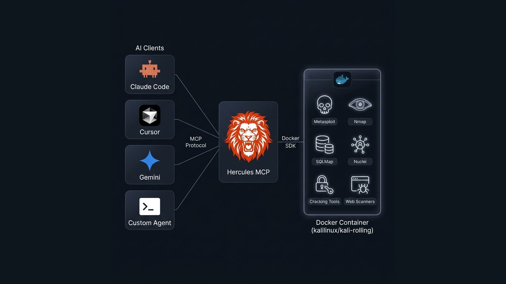

<p align="center">
  
</p>

<h1 align="center">Hercules MCP</h1>

<p align="center">
  <em>Offensive Security for AI Agents — through the Model Context Protocol</em>
</p>

<p align="center">
  
  
  
  
</p>

---

Hercules MCP is a [Model Context Protocol](https://modelcontextprotocol.io/) server that gives AI agents the ability to perform professional penetration testing. It orchestrates a fully containerized Kali Linux environment, exposing industry-standard offensive security tools as structured MCP tools that any MCP-compatible agent can reason about and drive autonomously.

<p align="center">
  
</p>

## Why Hercules?

### 🐳 Sandbox-First Architecture

Every command executes inside an ephemeral Docker container based on `kalilinux/kali-rolling`. Your host machine is never exposed — tools, exploits, and payloads stay isolated. Containers are created per-session and destroyed on shutdown by default.

### ⚡ Token-Cost Optimized

Hercules is designed for AI agents, not humans. Tool outputs are parsed and structured — raw XML, verbose banners, and redundant data are stripped before reaching the model. Only the information the agent needs is returned, saving thousands of tokens per interaction.

### 🔌 Works With Any MCP Client

Built on the open [MCP standard](https://modelcontextprotocol.io/). Connect it to any MCP-compatible agent or client — Claude Code, Cursor, Windsurf, Gemini CLI, or your own custom agent — with a single JSON config.

---

## Tooling

Hercules bundles the most widely-used offensive security tools, pre-installed and ready to use. To prevent agent tool confusion and hallucination, Hercules strictly limits access *only* to necessary and well-structured tools:

| Category | Tools |
|----------|-------|
| **Reconnaissance** | Nmap, Amass, dnsx, Whois, dig |
| **Web Scanning** | Nikto, Nuclei, WhatWeb, WPScan, Wafw00f, httpx, Arjun, Gobuster |
| **Exploitation** | Metasploit Framework, SQLMap, SearchSploit |
| **Password Cracking** | John the Ripper, Hydra |
| **Networking** | Ncat, curl, hping3 |
| **Post-Exploitation** | linPEAS, winPEAS, PowerUp, GTFOBins, LOLBAS |
| **CTF / Forensics** | Binwalk, Steghide, ExifTool |
| **System & Shell** | Full Kali Linux shell access (`shell_exec`), background jobs |

All tools are accessed through structured MCP tool calls with typed parameters, parsed outputs, and built-in concurrency control.

---

## Quick Start

> [!IMPORTANT]
> **Docker is required.** Before running the setup script, ensure you have [Docker](https://www.docker.com/) installed locally and the Docker daemon is up and running.

### Prerequisites

- [Docker](https://docs.docker.com/get-docker/) (Engine or Desktop)
- [Python 3.11+](https://www.python.org/downloads/)
- [uv](https://docs.astral.sh/uv/) (recommended)

### 1. Clone & Install

```bash
git clone https://github.com/<your-username>/hercules-mcp.git
cd hercules-mcp
uv sync
```

### 2. Build the Environment

```bash
python hercules_setup.py
```

This builds the `hercules-kali` Docker image and downloads wordlists (SecLists, rockyou.txt). One-time operation, ~10 minutes.

### 3. Configure

```bash
cp .env.example .env
```

Key settings:

| Variable | Default | Description |
|----------|---------|-------------|
| `MSF_PASSWORD` | `hercules` | Metasploit RPC password |
| `SKIP_METASPLOIT` | `false` | Skip Metasploit for faster startup |
| `ALLOWED_TARGETS` | *(empty)* | Restrict scanning to specific targets |
| `BLOCKED_TARGETS` | *(empty)* | Block specific targets |

See [`.env.example`](.env.example) for all options.

### 4. Start the Server

```bash
uv run hercules
```

---

## Connect to Your AI Agent

To connect Hercules to any MCP-compatible AI agent or client (such as Claude Code, Claude Desktop, Cursor, Windsurf, or your own custom agent), add the following server configuration to your client's MCP configuration file (e.g., `claude_desktop_config.json` or `.cursor/mcp.json`):

```json
{
  "mcpServers": {
    "hercules": {
      "command": "uv",
      "args": ["run", "hercules"],
      "cwd": "/absolute/path/to/hercules-mcp"
    }
  }
}
```

> **Note for Gemini CLI users:** A pre-built extension is available in the [`hercules-extension/`](hercules-extension/) directory. A portable manifest is also included at [`hercules-mcp.json`](hercules-mcp.json) for reference.

---

## Design Principles

<table>
<tr>
<td width="50%">

**🔒 Sandboxed Execution**

All tools run inside Docker. The host filesystem, network stack, and processes are never touched. Containers are ephemeral and destroyed after each session.

</td>
<td width="50%">

**📊 Structured Output**

Nmap returns parsed JSON, not 11KB of raw XML. Metasploit uses native RPC, not console scraping. Every tool returns clean, typed data the agent can reason about.

</td>
</tr>
<tr>
<td>

**⚖️ Concurrency Control**

Heavy operations (aggressive scans, exploits) and light operations (DNS lookups, file reads) are separated by async semaphores. No resource starvation.

</td>
<td>

**🛡️ Safety Controls**

Target allow/block lists, configurable resource limits, and full audit logging. Every command is logged with timestamp, tool, target, and result.

</td>
</tr>
<tr>
<td>

**🌐 Cross-Platform Compatibility**

Hercules natively supports Windows, macOS, and Linux out of the box. Automatic VPN detection, LHOST recommendation, and Docker port forwarding ensure that reverse shells and network scanners work flawlessly on any operating system without manual configuration.

</td>
<td>

**🧹 Token Optimization**

Raw output is parsed, filtered, and compressed before reaching the LLM. Useless interfaces, verbose XML, and redundant data are stripped — keeping context windows lean.

</td>
</tr>
</table>

---

## Project Structure

```
hercules-mcp/
├── hercules/                   # Python package
│   ├── main.py                 # FastMCP server entry point
│   ├── core/                   # Docker manager, config, concurrency
│   ├── tools/                  # MCP tool implementations
│   └── resources/              # Post-exploitation scripts
├── docker/                     # Container entrypoint
├── hercules-extension/         # Gemini CLI extension
├── Dockerfile                  # Kali container definition
├── hercules_setup.py           # First-time setup script
├── hercules-mcp.json           # MCP client manifest
├── pyproject.toml              # Project metadata
└── .env.example                # Configuration template
```

---

## Security

> **⚠️ Authorized Use Only**
>
> Hercules is built for authorized penetration testing, security research, CTF competitions, and lab environments. Never use it against systems without explicit written permission.

---

## License

[MIT](LICENSE)
