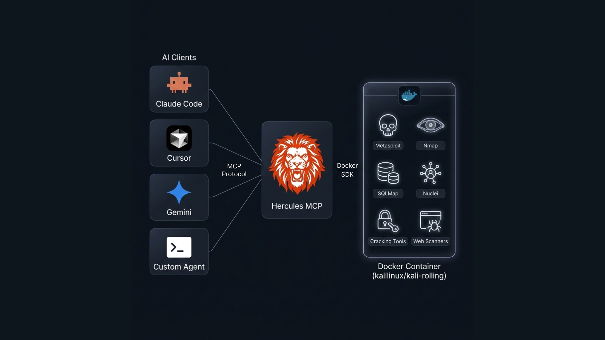

<p align="center">
  
</p>

<h1 align="center">Hercules MCP</h1>

<p align="center">
  <em>Containerized offensive-security tooling for AI agents through the Model Context Protocol</em>
</p>

<p align="center">
  
  
  
  
</p>

---

Hercules MCP is a [Model Context Protocol](https://modelcontextprotocol.io/) server that exposes offensive-security workflows as structured MCP tools. It starts a per-session Kali Linux Docker container, routes scanner and exploitation commands through that container, stores evidence in a local workspace, and returns compact, agent-friendly results.

<p align="center">
  
</p>

## Contents

- [Why Hercules?](#why-hercules)
- [Tools Available](#tools-available)
- [Stealth Browser](#stealth-browser)
- [Output, Artifacts, And Timeouts](#output-artifacts-and-timeouts)
- [Workspace Management](#workspace-management)
- [MCP Resources](#mcp-resources)
- [Quick Start](#quick-start)
- [Connect To An MCP Client](#connect-to-an-mcp-client)
- [Troubleshooting Setup](#troubleshooting-setup)
- [Design Principles](#design-principles)
- [Project Structure](#project-structure)
- [Acknowledgements](#acknowledgements)
- [Security](#security)
- [License](#license)

---

## Why Hercules?

### Sandbox-first execution

Tool commands run inside a Docker container based on `kalilinux/kali-rolling`. One owned host session is mounted at `/opt/workspace`. New managed installs keep session evidence in the platform user-data directory outside the checkout; existing installs retain `workspace/<session-id>/` until the operator explicitly migrates it. `HERCULES_WORKSPACE_ROOT` overrides either location.

Hercules uses one MCP server instance per project checkout. A startup lock prevents multiple live Hercules servers in the same checkout from removing or racing each other's containers. Containers are removed on shutdown by default; set `PRESERVE_CONTAINER=true` when you want to keep a session for debugging.

### Agent-focused output

Hercules is built for LLM use. A bounded terminal-state renderer handles ANSI/C1 control strings, carriage-return updates, backspaces, and erase-line operations without globally collapsing meaningful whitespace. Exact banners and characterized stdout progress may be compacted; stderr warnings and completeness diagnostics are retained. Full evidence is artifacted when inline output changes or exceeds its budget.

### MCP-native workflow mapping

Every public capability is exposed as a typed MCP tool or resource. The server includes rich instructions and tool descriptions so clients can map tasks to reconnaissance, web scanning, exploitation, post-exploitation, CTF, shell, file, and session workflows.

### Stealth browser automation

Drive cloakbrowser Chromium through structured `browser_*` tools to test JavaScript-heavy sites, navigate, snapshot, interact, return native MCP screenshots, and run page JavaScript. Fingerprint-reduction and proxy controls improve configuration consistency, but do not guarantee CAPTCHA or bot-detection avoidance. See [Stealth Browser](#stealth-browser).

### Selective installation and token budgeting

`hercules-install catalog --json` describes stable capability bundles, their MCP tools, backend binaries, wordlist needs, and an informational context estimate. A confirmed selection controls both the Docker image contents and the registered MCP schemas; core shell, workspace, and lifecycle services stay mandatory. Independently hiding an installed tool with `HERCULES_DISABLED_TOOLS` remains supported. Full installations retain the 45/40 surfaces, while custom profiles expose fewer tools and do not install omitted security backends.

### Resilient sessions

A single tool failure does not take down the session: uncaught tool exceptions are converted into structured errors by middleware. If the container crashes, Hercules can recover it while preserving the host workspace and session id. Container-local processes, background jobs, browser daemons, and Metasploit channels do not survive replacement; generation-bound caches are reset. An operator-requested stop remains terminal until `system_start_new_session` is called. One server runs per checkout, guarded by a startup lock.

---

## Tools Available

Expected registered tool count:

| Mode | Tool count |
|------|------------|
| Metasploit enabled, default `SKIP_METASPLOIT=false` | 45 |
| Lightweight mode, `SKIP_METASPLOIT=true` | 40 |

Counts are the full surface; selective installations expose only their confirmed bundles (see [Selective installation and token budgeting](#selective-installation-and-token-budgeting)).

Hercules exposes a compact MCP API over these Kali tools and workflow
capabilities. The MCP client sees structured tool calls, but the README keeps
the surface at the tool-family level so agents and operators can reason about
what is available without memorizing every selector or wrapper.

| Category | Available tools and capabilities |
|----------|-----------|
| Reconnaissance | Nmap, DNS lookups, dnsx, Whois, Amass |
| Web scanning | Nuclei, httpx, WhatWeb, Wafw00f, Nikto, WPScan, Arjun, ffuf, Gobuster |
| Web vulnerability testing | Dalfox, Commix, SQLMap |
| Exploitation | Metasploit Framework, SearchSploit, payload generation, listener management, session/job management |
| Password attacks | Hydra, John the Ripper |
| Networking | curl, Ncat, hping3 |
| CTF and forensics | Binwalk, Steghide |
| Browser | cloakbrowser Chromium driven by agent-browser: navigate, accessibility snapshot, click/type/fill, wait, native MCP screenshot, eval JS, network/HAR capture, isolated sessions — see [Stealth Browser](#stealth-browser) |
| Shell and workspace | Direct Kali shell commands inside the container, background jobs, workspace file read/write, binary-safe file transfer |
| System/session control | Container session lifecycle, active session listing, network information |

Agents can write their own custom Nmap NSE scripts and Nuclei templates through
the MCP workflow, save them into the container workspace, validate them, and run
them against authorized targets. Agents also have direct shell-command access to
the Kali container, so they can use installed tools manually when a structured
tool call is not the right fit.

The server keeps redundant thin wrappers out of the public MCP surface. Related
operations are grouped behind structured parameters, while specialized workflows
such as Nmap NSE authoring, Nuclei template authoring, SQLMap, curl, hping3, and
directory fuzzing remain directly accessible where dedicated controls are useful.

The exact MCP function names, parameters, and selector values are advertised by
the MCP server itself through tool metadata.

---

## Stealth Browser

Hercules ships cloakbrowser Chromium so agents can manually test JavaScript-heavy sites, reproduce web bugs interactively, and capture visual evidence. Structured `browser_*` tools navigate, expose an accessibility-tree snapshot with stable element refs, interact with controls, wait for dynamic content, return validated PNGs as native MCP `ImageContent`, run page JavaScript, and capture network/HAR traffic in isolated sessions. `browser_cmd` is an administrator escape hatch to other supported agent-browser subcommands. Browser sessions are always headless; screenshots and loopback streaming remain available.

### Browser identity, proxy, and egress behavior

Hercules joins two open-source projects, each used for its strength:

- **[agent-browser](https://github.com/vercel-labs/agent-browser)** is the *controller* — a Rust CLI with a persistent daemon that exposes an agent-friendly accessibility snapshot (with `@ref` element handles) plus the full click / type / wait / eval command surface.
- **[cloakbrowser](https://github.com/CloakHQ/cloakbrowser)** is the *engine* — a Chromium built with compile-time C++ patches that remove the tell-tale signals of automation.

Agent-browser launches the cloakbrowser executable directly and holds it open across calls. Each session records its effective proxy, locale, timezone, allowed-domain policy, and container generation; changing a launch-affecting setting closes and relaunches that session. The pinned controller does not expose deterministic fingerprint selection, so a non-empty `fingerprint` parameter is rejected rather than reported as applied; cloakbrowser's built-in fingerprint reduction remains active. Proxy precedence is the per-call `proxy` parameter, then `BROWSER_PROXY_URL`, then direct host egress. Proxy credentials are passed to the process but redacted from logs and responses. When a proxy is active, Hercules blocks non-proxied WebRTC UDP by default.

Docker networking does not provide residential egress. Direct browser traffic normally has the same public IP as the host, so operators who require residential or ISP egress must supply an authenticated proxy. Verify public egress only through an operator-authorized IP-check page. Fingerprint reduction and aligned locale/timezone settings can improve consistency, but Hercules cannot guarantee avoidance of CAPTCHAs or bot detection.

`browser_screenshot` always returns native inline image content on success plus path, PNG dimensions, byte count, MIME type, and command status. `annotate=true` requests agent-browser's annotated screenshot; `return_base64=true` adds only a legacy compatibility copy.

`browser_snapshot` exposes the pinned controller's `interactive`, `include_urls`,
`depth`, and `selector` options. `detailed=true` requests an uncompacted,
unlimited-depth tree; iframes are automatically inlined, so `inline_iframes`
remains only a compatibility hint. Semantic targets support click, fill, check,
hover, and text reads. Use a snapshot ref or CSS for semantic HTML/value reads
and for type/select/uncheck. Load `browser_skill` before using the raw
administrator-level `browser_cmd` surface.

> Special thanks to the **agent-browser** and **cloakbrowser** projects for making this possible — see [Acknowledgements](#acknowledgements).

---

## Output, Artifacts, And Timeouts

Hercules returns tool output in a way that is easier for agents to reason about:

- Clean output by default: terminal colors, escape codes, progress rewrites, and
  known scanner banners are removed before output is sent back to the agent.
- Clear completeness signals: `output_complete` describes the inline
  representation, while `evidence_complete` says whether complete raw evidence
  is still inline or in a verified artifact. Byte/character counts and a rough,
  model-neutral inline token estimate are also returned.
- Evidence is preserved: when output is filtered or shortened, Hercules saves the
  fuller stdout, stderr, or raw command stream as workspace artifacts.
- Artifact paths are returned in the result: agents can open those saved files
  through the workspace file tools when they need full logs, generated payloads,
  raw scanner output, or command evidence.
- Useful metadata stays visible: `output_filtered`, `output_transform`,
  truncation flags, raw/inline counts, artifact paths, and filter versions show
  exactly what changed. Structured Nmap, Nuclei, ffuf, httpx, and browser JSON
  results replace identical duplicate stdout when parsing succeeds.
- Output remains bounded: each stream has an 8,000-character default limit and
  stdout/stderr share a 12,000-character response budget. Invalid UTF-8 or
  binary-like streams return a concise artifact notice instead of replacement
  character noise.
- Timeouts are explicit: foreground Docker execs return `timed_out`,
  `terminated`, and `partial_output` metadata. Hercules terminates the process
  group and preserves captured stdout/stderr and artifacts; if termination
  cannot be confirmed, the result says so.
- Long tasks have safer paths: agents can increase a timeout when the tool allows
  it, run a background job, or use a listener/session workflow instead of waiting
  on one foreground command.

---

## Workspace Management

Every Hercules-owned session has an atomic, non-secret manifest with its
eight-character hexadecimal ID, timestamps, generation, active state, and
pinning state. Paths are checked before and after resolution; traversal,
alternate-drive/device paths, and symlink or reparse-point escapes are rejected.
Large reads are paged with `offset`, `max_bytes`, `truncated`, and `next_offset`
metadata.

Evidence retention is disabled by default. The host-side CLI never deletes
non-empty evidence unless the operator explicitly applies a prune:

```bash
hercules-workspace list --json
hercules-workspace pin 1a2b3c4d
hercules-workspace prune --older-than 30 --max-sessions 20
hercules-workspace prune --older-than 30 --max-sessions 20 --apply
hercules-workspace migrate --destination /durable/hercules/workspaces
```

Pruning always preserves active, pinned, unowned, and running-job sessions.
Migration copies to staging, verifies file checksums, switches the destination,
and retains the source unless `--delete-source` is explicitly supplied.

---

## MCP Resources

Hercules also exposes resources that help agents decide what to write or run:

| Resource group | What it provides |
|----------------|------------------|
| `resource://agent_skills/nse` | A detailed agent handbook for designing, writing, validating, debugging, and running complex custom NSE scripts. |
| `resource://agent_skills/nuclei` | A detailed agent handbook for designing, writing, validating, debugging, and running custom Nuclei templates. |
| Linux post-exploitation | linPEAS-style enumeration content and GTFOBins knowledge for Linux privilege-escalation decisions. |
| Windows post-exploitation | winPEAS-style checks, PowerUp-style PowerShell checks, and LOLBAS knowledge for Windows privilege-escalation and living-off-the-land decisions. |

Agents should read the NSE or Nuclei skill resource before creating custom
detection logic. After getting a shell or Metasploit session, agents should use
the post-exploitation resources to choose the right enumeration scripts,
privilege-escalation checks, and living-off-the-land techniques.

The installable [`hercules-mcp` Agent Skill](skills/hercules-mcp/SKILL.md)
adds provider-neutral task routing across the complete tool surface. Its NSE and
Nuclei references are also the canonical source for the two corresponding MCP
resources, so installed skill guidance and server resources stay synchronized.

---

## Quick Start

### One setup prompt for every supported agent

Paste this prompt unchanged into any terminal-capable coding agent. It detects
the host and installs the native Codex, Claude Code, or Cursor adapter when
available, with a portable Agent Skills and STDIO MCP fallback for other
compatible clients.

```text
Install or upgrade Hercules MCP from https://github.com/0xMihirK/hercules-mcp using https://github.com/0xMihirK/hercules-mcp/blob/main/install.md as guidance. Adapt the installation to my operating system, shell, available package manager, Docker environment, and current terminal-capable AI agent instead of assuming a particular platform. Before a first install, ask what I intend to use Hercules for and whether I want every capability or a smaller installation. If I choose a smaller installation, inspect Hercules’ capability catalog, use your judgment to recommend the minimum useful set, briefly explain important omissions, and get my confirmation before installing. Also ask whether configuration should be user-wide or project-local, and ask about a browser proxy only if browser capability is selected. Preserve my confirmed capability selection, `.env`, secrets, workspace evidence, downloaded assets, and client settings during upgrades unless I explicitly change them. Install the portable skill and an appropriate native adapter, register the secret-free Hercules STDIO MCP server, and run local non-destructive verification. Never print secrets, scan or navigate to an external target during setup, or silently perform privileged system changes; clearly tell me when a prerequisite or manual action is required.
```

The installer keeps one provider-neutral portable skill as the source of truth
and installs it independently. Native plugin manifests are MCP-only adapters;
they do not embed or declare skills. Hosts must support local Agent Skills
and/or a STDIO MCP server; unsupported hosts receive an explicit manual
configuration path instead of a false success report.

### Prerequisites

- Docker Engine or Docker Desktop with the Docker daemon running
- Python 3.11+
- `uv` is recommended for local dependency management

### 1. Inspect and choose capabilities

```bash
uvx --python 3.12 --from git+https://github.com/0xMihirK/hercules-mcp.git hercules-install catalog --json
```

The agent should recommend the smallest useful set from this live catalog and
obtain confirmation. Core shell, workspace, and lifecycle bundles are always
included.

### 2. Install the confirmed profile

```bash
uvx --python 3.12 --from git+https://github.com/0xMihirK/hercules-mcp.git hercules-install install --client auto --scope user --capabilities all
```

Replace `all` with `core` or confirmed comma-separated catalog keys. Fresh
non-interactive installs require an explicit selection. The installer builds an
immutable capability-specific image and downloads only selected wordlist assets.
Useful commands:

```bash
hercules-install check --json
hercules-install check --runtime-only --json
hercules-install install --rebuild --capabilities all
hercules-install upgrade --client auto
```

### 3. Verify or customize the preserved environment

The installer creates or updates the protected `.env` without replacing
existing values. Do not copy `.env.example` over a managed installation: edit
only the specific existing values you intend to change, then rerun
`hercules-install check --runtime-only --json`.

Common settings:

| Variable | Default | Description |
|----------|---------|-------------|
| `MSF_PASSWORD` | generated | The installer persists a random 32-byte URL-safe RPC secret when missing. Explicit secrets are preserved; the historical `hercules` value triggers a warning. The secret is never included in summaries. |
| `MSF_RPC_PORT` | `55553` | Loopback-only Metasploit RPC port. Override it when multiple isolated Hercules instances run concurrently. |
| `SKIP_METASPLOIT` | `false` | Set to `true` to omit Metasploit tools and skip RPC startup. |
| `HERCULES_INSTALLED_CAPABILITIES` | managed by installer | Confirmed comma-separated capability bundles; absent legacy installations migrate as full. |
| `PRESERVE_CONTAINER` | `false` | Keep the Docker container after MCP shutdown for debugging. |
| `USE_PRIVILEGED` | `false` | Use Docker `--privileged` instead of minimal network capabilities. |
| `MAX_CONCURRENT_HEAVY` | `3` | Semaphore limit for heavy operations. |
| `MAX_CONCURRENT_LIGHT` | `10` | Semaphore limit for light operations. |
| `ALLOWED_TARGETS` | empty | Comma-separated allow-list. Empty means no allow-list restriction. |
| `BLOCKED_TARGETS` | empty | Comma-separated block-list. Block rules take priority. |
| `CONTAINER_CPU_LIMIT` | `0` | Docker CPU limit. `0` means unlimited. |
| `CONTAINER_MEM_LIMIT` | `0` | Docker memory limit. `0` means unlimited. |
| `DEFAULT_TIMEOUT` | `300` | Default command timeout in seconds. |
| `HERCULES_WORKSPACE_ROOT` | managed data directory or legacy checkout path | Override the host evidence root. Existing installations are not moved automatically. |
| `HERCULES_MAX_INLINE_FILE_BYTES` | `8388608` | Hard ceiling for one inline workspace read; use paging for larger files. |
| `HERCULES_MAX_CAPTURED_OUTPUT_BYTES` | `2097152` | Bounded in-memory head/tail capture before complete output streams to artifacts. |
| `HERCULES_MAX_INLINE_RESPONSE_CHARS` | `12000` | Combined default inline stdout/stderr budget; each stream remains capped at 8,000 characters. |
| `HERCULES_MAX_BACKGROUND_JOBS` | `8` | Maximum current-generation managed jobs. |
| `HERCULES_WORKSPACE_AUTO_PRUNE` | `false` | Opt in to automatic retention. Evidence is preserved by default. |
| `HERCULES_WORKSPACE_RETENTION_DAYS` / `HERCULES_WORKSPACE_MAX_SESSIONS` / `HERCULES_WORKSPACE_MAX_BYTES` | `0` | Optional retention limits; zero disables each rule. |
| `HERCULES_LISTENER_PORTS` | `4444-4464` | Explicit reverse-listener ports exposed by bridge networking. |
| `HERCULES_LISTENER_BIND_HOST` | `0.0.0.0` | Host bind for explicitly configured reverse-listener ports. Use `127.0.0.1` for isolated local labs. |
| `HERCULES_DOCKER_NETWORK` | empty | Optional existing Docker network for operator-managed isolated labs; Linux otherwise retains host networking. |
| `HERCULES_DISABLED_TOOLS` | empty | Independently hide installed MCP tools. Core tools cannot be disabled. This does not add omitted binaries. |
| `BROWSER_STREAM_PORT` | `0` | Forward the selected session's live-view WebSocket to host loopback (`0` = off). Docker Desktop uses a private container relay port. |
| `BROWSER_PROXY_URL` | empty | Default HTTP(S) or SOCKS5 proxy. A `browser_open(proxy=...)` value takes precedence. Credentials are redacted from output. The legacy `BROWSER_PROXY` name is accepted for one compatibility release. |
| `BROWSER_DISABLE_NON_PROXIED_UDP` | `true` | Block non-proxied WebRTC UDP whenever a browser proxy is active. |
| `BROWSER_TIMEZONE` / `BROWSER_LOCALE` | empty | Optional defaults for the browser launch profile. |
| `WATCHDOG_INTERVAL` | `20` | Seconds between container health checks; `0` disables the watchdog. |

`TOOL_INSTALL_MODE` is deprecated and has no build effect. It is accepted for one compatibility release with a warning.

### 4. Start the MCP server

```bash
uv run hercules
```

On Windows, you can start the server through `uv run hercules` from PowerShell,
or point an MCP client at the virtual-environment Python executable with
`-m hercules.main`.

---

## Connect To An MCP Client

`hercules-install` handles Codex, Claude Code, Cursor, and portable Agent
Skills/STDIO hosts. Its public commands are:

```bash
hercules-install install --client auto
hercules-install upgrade --client auto
hercules-install check --json
hercules-install doctor --json
```

It asks for user-global versus project-local scope only on first install,
defaults to user-global, and preserves the choice on upgrades. `--client all`
configures all native adapters plus the portable fallback. Restart the client
after installation so it reloads the MCP server and skill.

For a generic STDIO MCP client, the generated secret-free configuration is:

```json
{
  "mcpServers": {
    "hercules": {
      "command": "hercules",
      "args": []
    }
  }
}
```

Secrets and runtime preferences remain in the managed checkout's `.env`; they
are never copied into agent MCP configuration. See [install.md](install.md) for
the deterministic fast path, upgrade rules, state locations, and diagnostic
codes.

---

## Troubleshooting Setup

If image provisioning fails, first confirm that the selected Docker-compatible
context works with `docker info`, then rerun:

```bash
hercules-install doctor --json
hercules-install install --rebuild --capabilities all
```

Kali package mirror errors such as `Failed to fetch`, `temporary failure`, or `Hash Sum mismatch` are usually transient mirror, DNS, proxy, VPN, or Docker networking issues. The Dockerfile retries package installation, uses `--fix-missing`, and switches Kali mirror URLs to `kali.download`, but persistent network failures still need local networking fixes.

If the image exists but runtime checks fail, rebuild and verify:

```bash
hercules-install install --rebuild --capabilities all
hercules-install check --runtime-only --json
```

The installer builds from a private minimal context and stamps the image with
its exact capability set and runtime-input fingerprint. A raw `docker build` omits that readiness
metadata and is therefore intentionally treated as stale.

If a client reports no Hercules tools, confirm that only one MCP server is running for this checkout and that the client command points at this repository. Multiple server processes for the same checkout are rejected by the instance lock; older processes from other checkouts should be stopped if they are not needed.

---

## Design Principles

| Principle | What it means |
|-----------|---------------|
| Sandboxed execution | Tools run inside Docker with a mounted workspace for evidence and generated files. |
| Stable tool API | Public tool names, selectors, signatures, target validation, concurrency class, timeout behavior, and success response fields are treated as compatibility-sensitive. |
| Structured output | Tools return parsed or compacted output where useful, while full evidence is preserved through artifacts when filtering or truncation occurs. |
| Concurrency control | Heavy operations and light operations use separate async semaphores. |
| Target controls | Structured tools canonicalize hostnames, IDNA, IP literals, CIDRs, ports, and URLs; reject CR/LF; resolve hostnames while scopes are active; and apply `ALLOWED_TARGETS` and `BLOCKED_TARGETS` before execution. |
| Cross-platform operation | The server runs on Windows, macOS, and Linux as long as Python and Docker are available. |

---

## Project Structure

```text
hercules-mcp/
|-- hercules/
|   |-- main.py                  # FastMCP entrypoint and tool/resource registration
|   |-- core/                    # Config, runtime/workspace services, Docker facade, execution/jobs
|   |-- installer_support/       # Platform, runtime provisioning, and atomic state
|   |-- output/                  # Sanitizer, banner stripping, filters, truncation
|   |-- tools/                   # MCP tool implementations by category (incl. browser/)
|   `-- resources/               # Agent skill docs and post-exploitation resources
|-- docker/
|   `-- entrypoint.sh            # Container readiness and loopback-only msfrpcd
|-- skills/hercules-mcp/         # Canonical provider-neutral Agent Skill
|-- .codex-plugin/               # Thin Codex plugin manifest
|-- .claude-plugin/              # Thin Claude Code plugin manifest
|-- .cursor-plugin/              # Thin Cursor plugin manifest
|-- workspace/                   # Legacy evidence root (managed installs use OS data storage)
|-- wordlists/                   # Verified archives and extracted host cache
|-- Dockerfile                   # Kali container image definition
|-- install.md                   # Universal agent-executable installation contract
|-- hercules-mcp.json            # Example MCP client manifest
|-- pyproject.toml               # Project metadata
`-- .env.example                 # Environment configuration template
```

---

## Acknowledgements

Hercules stands on the shoulders of excellent open-source work. The stealth
browser in particular would not exist without two projects, and we are grateful
to both:

- **[agent-browser](https://github.com/vercel-labs/agent-browser)** — the Rust
  browser-control CLI and persistent daemon that gives agents an
  accessibility-first way to drive a real browser. It powers every `browser_*`
  tool in Hercules.
- **[cloakbrowser](https://github.com/CloakHQ/cloakbrowser)** — the
  fingerprint-patched Chromium used for browser automation.

Thanks also to the wider ecosystem Hercules builds on:
[Kali Linux](https://www.kali.org/), the
[Metasploit Framework](https://www.metasploit.com/),
[ProjectDiscovery](https://projectdiscovery.io/) (nuclei, httpx, dnsx),
[SecLists](https://github.com/danielmiessler/SecLists),
[FastMCP](https://github.com/jlowin/fastmcp).

---

## Security

Hercules is intended only for authorized penetration testing, security research, CTF competitions, and lab environments.

- The permissive default allows any target until `ALLOWED_TARGETS` or `BLOCKED_TARGETS` is configured. Structured DNS/WHOIS, HTTPX, Nmap, browser, scanner, redirect, and Metasploit target routes enforce the configured policy and validate all resolved addresses.
- `shell_exec`, `browser_cmd`, and every documented raw `extra_args` parameter are trusted-administrator escape hatches outside structured-target guarantees. The container intentionally provides root-level offensive-security tooling; Docker is a containment boundary, not a substitute for host hardening.
- Metasploit RPC and browser-stream ports bind to host loopback. Configured reverse-listener ports remain externally reachable so callbacks work. Protect the Docker host and do not expose its daemon.
- Passwords, tokens, cookies, sensitive form data, and proxy credentials are redacted from returned command strings, logs, and artifact headers. Supplying secrets to third-party tools still gives those processes access to the original values.
- Redirect restrictions are applied where the wrapper can enforce them. Raw tools may follow redirects or open new destinations according to their own flags.
- Local tests are intentionally ignored by Git, excluded from wheels and source distributions, and are not uploaded with the repository. Maintainers run them from a separate local-only suite.

`pymetasploit3` is temporarily pinned despite [GHSA-qpc3-8vqg-8g6w](https://osv.dev/vulnerability/GHSA-qpc3-8vqg-8g6w): no fixed release exists, Hercules does not call the affected `run_module_with_output` API, and option keys/values reject CR/LF before RPC dispatch.

---

## License

[MIT](LICENSE)
